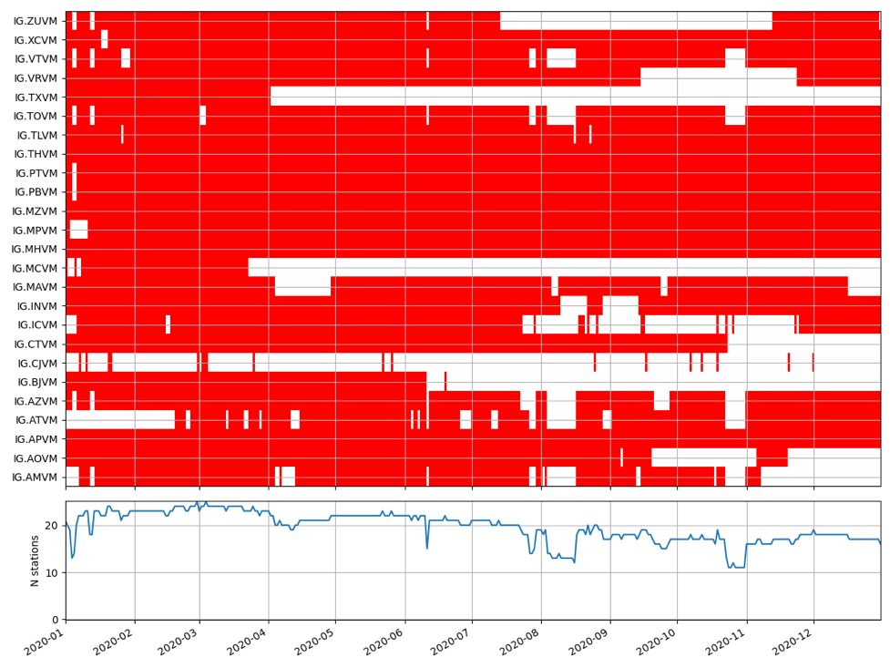

# DATA INSTRUCTIONS

The seismic network of the valley of Mexico has been operating for more than 15 years, and has allowed, for the first time, to have seismicity information in the metropolitan area. In the case of the available data, there is the only restriction to be used exclusively in studies of dominant periods, the data cannot be used for other purposes, (e.g.localize events, power spectra analysis, or calculation of Green's functions). 

Our data are published in an open access repository ([https://doi.org/10.5281/zenodo.5765191](https://doi.org/10.5281/zenodo.5765191)) and consist of more than 99 thousand files. The data are serialized in pickle formats, and the information can be easily decoded with codes published in GITHUB also freely available to the public ([https://github.com/rortegaru/perdominantes](https://github.com/rortegaru/perdominantes)).
The data contain sensor information and processing dictionaries that can be applied to the HVSRP technique ([https://github.com/jpvantassel/hvsrpy](https://github.com/jpvantassel/hvsrpy)), and have been prepared in this way to facilitate access and to make it possible to review our calculations by our reviewers. The advantage of this digital representation is that the sensor3c has quality control properties that make it easy to manipulate the time series. This representation was proposed by Vantassel (2017) and has been adopted as a standard in the calculation of spectral ratios. Another advantage of the data is that it can be handled internally with dictionaries and json files for efficient transmission over the internet. Some characteristics are: 1) the data are demultiplexed and a detrend has been applied, 2) a 40% coseniodal taper has been applied, 3) a trace with the combination of the horizontal components has been appended, 4) instances of the HVSRPY class have been saved to facilitate the computational process. Figure 1 shows all data availability in 2020. The colored area means available data, while the white area means no data.

Table 1 presents the member functions available to the HVSRP class to operate on the data. An important restriction is that these data can only be used for H/V spectral ratio studies, for that reason they have been designed and opened to the public.

